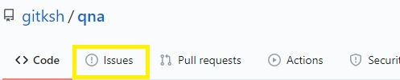
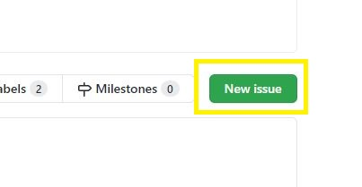
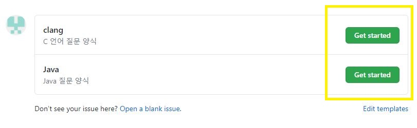
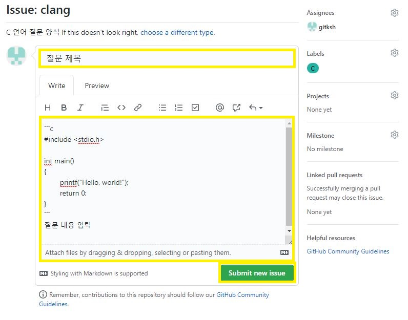
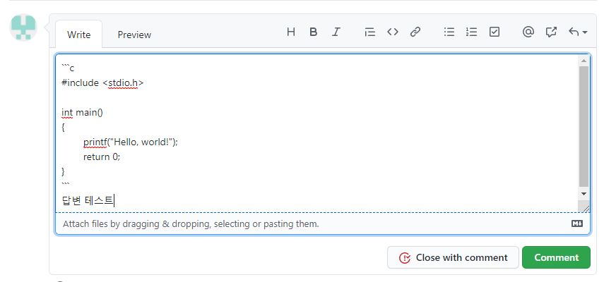
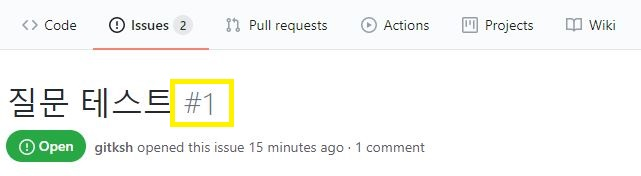
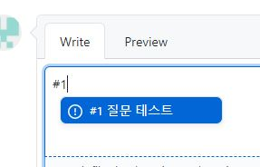
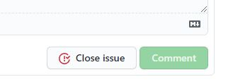
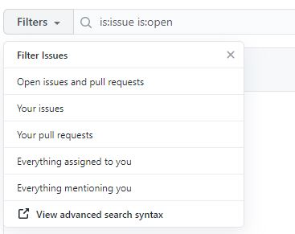

# QnA
## 상태
 

## 바로가기
[https://github.com/gitksh/qna/issues](https://github.com/gitksh/qna/issues)


## 목적

학교 코딩 동아리 와 코딩 스터디 진행에 앞서 소스를 포함한 질문과 답변을 보다 쉽게 하기 위해 생성 되었습니다.

가이드라인을 읽고 질문과 답변하는 방법을 알고 질문과 답변을 하시면 됩니다.

## 가이드라인

### 1. 질문하기


**Issues** 탭 혹은 [이곳](https://github.com/gitksh/qna/issues)을 클릭합니다.



우측의 녹색 **New issue** 버튼을 클릭합니다.



질문하고자하는 언어의 녹색 **Get started** 버튼을 클릭합니다. 



질문 제목, 질문 내용 (해당 소스 포함) 하여 질문을 작성후 녹색 **Submit new issue** 버튼을 눌러 질문 작성을 완료합니다.

질문 내용의 소스는 **```** 로 감싸서 질문을 보았을때 보다 보기 쉽게 할 수 있습니다.

**\`** 는 키보드 좌측 1옆, 탭위에 있는 **`~** 입니다.

### 2. 답변 달기
> 올라온 질문은 누구나 답변을 작성해도됩니다.
> 
#### 기본적인 방법


질문 글을 보면 하단에 Comment를 작성할 수 있습니다.

작성 후 녹색 **Comment**를 클릭하여 작성을 완료합니다.

#### 중복된 유형

중복된 유형으로 질문하는 경우가 있습니다.

똑같은 답변을 2번 작성하는 것은 귀찮으니 다른방법을 사용해봅시다. 



질문글의 제목 옆 **`#n`** 은 질문글의 고유한 번호입니다.



중복된 유형의 질문의 답변으로 **`#n`** 를 사용합니다.

### 3. 질문 닫기


문제가 해결되었다면, 질문자는 **Close issue** 버튼을 눌러 마감할 수 있습니다.

### 4. 자신이 했던 질문 찾기



이슈 페이지에서 **Filters** 통하여 이슈들을 필터링 할 수 있습니다.

**Your issues** 는 자신이 올린 질문들을 모두 보여줍니다.

나머지는 QnA에서 잘 사용하지 않습니다.